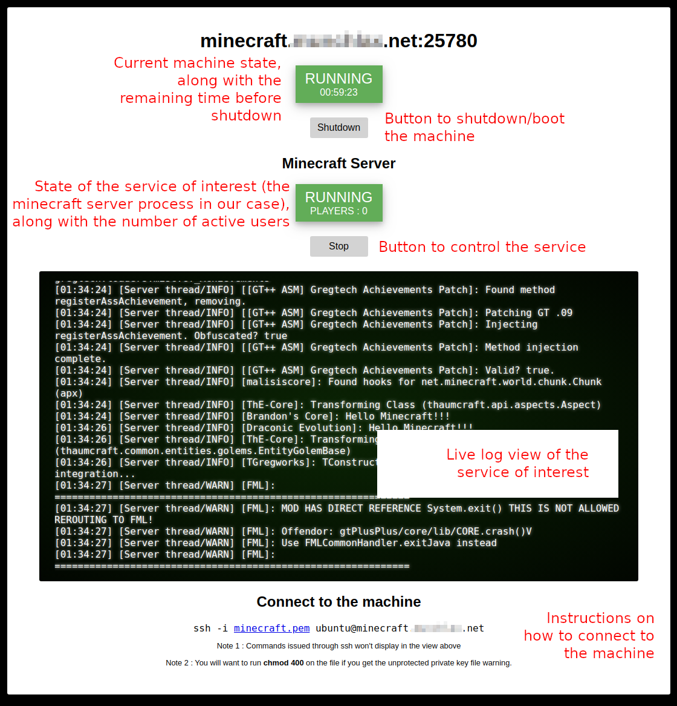

# powerbutton
This web app acts as a power button for an AWS linux machine of your choice, enabling you to share that resource with your less technical friends. When the machine is needed, anybody with the credentials can log in and boot the machine.
When the machine is not used for a while, it will be shut down automatically.

## Quick start
**On the machine you will use as the power button**
1. `git clone https://github.com/stevefortier/powerbutton.git`
2. Edit the `config.json` file with your own configuration. Put your secret configuration files into a `secrets/` folder you create. You can use the files you find in `secretsExample/` as a starting point.
3. `sudo docker-compose up`

**On the machine controlled by the power button**
1. Log in the AWS machine and copy the `remote/` files directly into the home directory of the ssh user the app will use to control the AWS machine.
2. Modify the start.sh file so it opens the app you are interested in.

## "Demo"
Here, the app is used to control a minecraft server:

## TODO
- [ ] Copy the `remote/` files to the controlled machine files automatically via ssh
- [ ] Make the `remote/` files accept arguments regarding which app to boot and what is the working directory
- [ ] Factor the minecraft server polling out from the main app, so the app is completely agnositic about what app it's controlling.
